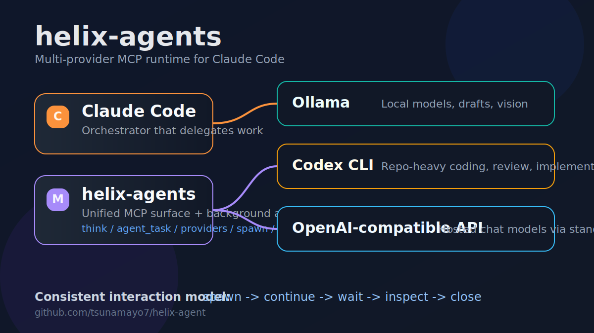

# helix-agents

Multi-provider MCP server for Claude Code.

`helix-agents` lets Claude Code delegate work through one consistent runtime to:

- `ollama` for local models and vision
- `codex` for repo-heavy coding work
- `openai-compatible` for hosted chat models

[](LICENSE)
[](https://www.python.org/)
[](https://modelcontextprotocol.io)
[](#providers)



## Why It Looks Different

Most MCP servers still feel like one-shot tool bridges.

`helix-agents` is designed to feel closer to a Claude Code sub-agent runtime:

- choose the right provider for the task
- keep a consistent tool surface
- spawn background workers
- continue those workers with follow-up instructions
- wait, inspect, and close cleanly

## Highlights

- Multi-provider routing with `provider="auto" | "ollama" | "codex" | "openai-compatible"`
- Claude Code-style background agent lifecycle
- Codex support without losing the existing Ollama path
- One MCP server instead of separate provider-specific bridges
- Vision support on the Ollama path

## Architecture

```text
Claude Code
  -> helix-agents MCP
     -> Ollama
     -> Codex CLI
     -> OpenAI-compatible API
```

The important part is not just provider switching. The interaction model stays consistent across providers.

## Tools

Core tools:

- `think`
- `agent_task`
- `see`
- `providers`
- `models`
- `config`

Background agent tools:

- `spawn_agent`
- `send_agent_input`
- `wait_agent`
- `list_agents`
- `close_agent`

## Typical Work Split

| Task shape | Recommended provider |
|---|---|
| Local draft, summarization, OCR, vision | `ollama` |
| Repo changes, code review, implementation | `codex` |
| Hosted model access through standard APIs | `openai-compatible` |

## Quick Start

```bash
git clone https://github.com/tsunamayo7/helix-agent.git
cd helix-agent
uv sync
uv run python server.py
```

Add it to Claude Code:

```json
{
  "mcpServers": {
    "helix-agents": {
      "command": "uv",
      "args": ["run", "--directory", "/path/to/helix-agent", "python", "server.py"]
    }
  }
}
```

## Examples

Use Codex for a repo review:

```text
think(
  task="Review this diff for regressions",
  provider="codex",
  cwd="/repo"
)
```

Use Ollama for a local summary:

```text
think(
  task="Summarize this build log",
  provider="ollama"
)
```

Spawn a background investigation worker:

```text
spawn_agent(
  description="Investigate flaky tests",
  provider="codex",
  agent_type="explorer"
)
```

Then continue it:

```text
send_agent_input(...)
wait_agent(...)
close_agent(...)
```

## Providers

### Ollama

- local reasoning
- low-cost drafts
- vision and image analysis

### Codex

- repo-aware code work
- implementation and review flows
- background workers with `cwd` and sandbox control

### OpenAI-compatible

- standard chat completions style endpoints
- useful when you want hosted models without changing the MCP surface

## Configuration

Use `config(action="show")` to inspect runtime settings.

Important keys:

- `default_provider`
- `ollama_host`
- `codex_model`
- `codex_sandbox`
- `openai_base_url`
- `openai_api_key_env`
- `openai_model`

## Notes

- Codex requires `codex` on `PATH`
- OpenAI-compatible mode requires an API key
- Vision is currently centered on the Ollama path

## Contributing

See [CONTRIBUTING.md](CONTRIBUTING.md).

## Security

See [SECURITY.md](SECURITY.md).
