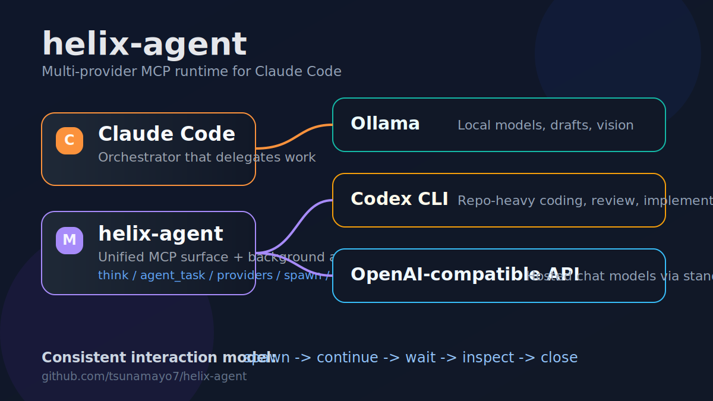

# helix-agent

Claude Code 向けの、複数 LLM プロバイダを 1 つの MCP で扱えるランタイムです。

`helix-agent` は次の provider に同じ操作感で委譲できます。

- `ollama`
- `codex`
- `openai-compatible`



## 特徴

- `provider="auto" | "ollama" | "codex" | "openai-compatible"` で切り替え
- Claude Code 風の background agent lifecycle
- Ollama のローカル経路を残したまま Codex と API 系を追加
- provider ごとに操作が分かれず、同じ MCP 面で扱える

## 何が良いか

多くの MCP は単発呼び出しで終わります。

`helix-agent` はそれより一段自然で、Claude Code の sub-agent に近い形を狙っています。

- provider を選ぶ
- background worker を起動する
- 追加指示を送る
- 完了を待つ
- 状態を確認して閉じる

## ツール

コア:

- `think`
- `agent_task`
- `see`
- `providers`
- `models`
- `config`

background agent:

- `spawn_agent`
- `send_agent_input`
- `wait_agent`
- `list_agents`
- `close_agent`

## 使い分け

| タスク | 向いている provider |
|---|---|
| ローカル要約、Vision、OCR | `ollama` |
| repo をまたぐ実装、レビュー、修正 | `codex` |
| API 経由の chat model | `openai-compatible` |

## セットアップ

```bash
git clone https://github.com/tsunamayo7/helix-agent.git
cd helix-agent
uv sync
uv run python server.py
```

Claude Code には次のように追加します。

```json
{
  "mcpServers": {
    "helix-agent": {
      "command": "uv",
      "args": ["run", "--directory", "/path/to/helix-agent", "python", "server.py"]
    }
  }
}
```

## 例

Codex で差分レビュー:

```text
think(
  task="この差分の回帰リスクを見て",
  provider="codex",
  cwd="/repo"
)
```

Ollama でローカル要約:

```text
think(
  task="このビルドログを要約して",
  provider="ollama"
)
```

調査 worker を起動:

```text
spawn_agent(
  description="flaky test 調査",
  provider="codex",
  agent_type="explorer"
)
```

続けて:

```text
send_agent_input(...)
wait_agent(...)
close_agent(...)
```

## 設定

`config(action="show")` で主な設定を確認できます。

- `default_provider`
- `ollama_host`
- `codex_model`
- `codex_sandbox`
- `openai_base_url`
- `openai_api_key_env`
- `openai_model`

## 補足

- Codex は `codex` CLI が `PATH` に必要です
- OpenAI-compatible は API キーが必要です
- Vision は現状 Ollama 経路中心です

## Contributing

[CONTRIBUTING.md](CONTRIBUTING.md) を参照してください。

## Security

[SECURITY.md](SECURITY.md) を参照してください。
